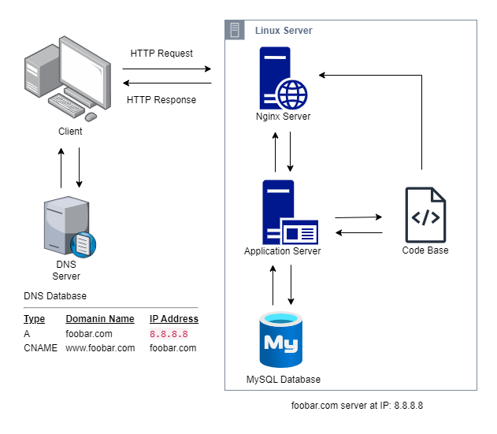

## Simple web stack

**What is a server**
- A server is a computer or system that provides resources, data, services, or programs to other computers

**What is the role of the domain name**
- A domain name mainly used to identify a website not only to people but to other devices on a network.

**What type of DNS record www is in www.foobar.com**
- www is a CNAME record that denotes that www.foobar.com is a subdomain of foobar.com. Historically www.foobar.com would be the web server for the website (the primary page), but the main or primary domain of a website is now simply foobar.com and www.foobar.com is an alias or CNAME that resolves to foobar.com.

**What is the role of the web server**
- The web serve is composed of computer software and hardware that is meant to accept http or https requests.

**What is the role of the application server**
- The application server is meant to provide business logic or more processing for tasks such creating or serving dynamic content on a website, data access and manipulation.

**What is the role of the database**
- The role of a database is to store, retrieve and update information.

**What is the server using to communicate with the computer of the user requesting the website**
- The server and the computer communicate using their IP addresses. The server uses the IP address of the computer to identify the users computer and send any requested information.
